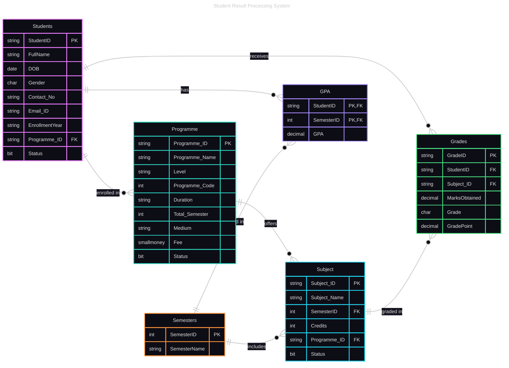

<h1 align="center">Student Result Processing System</h1>
<h2 align="center">Comprehensive Project Report</h2> 

## Abstract
The Student Result Processing System is a comprehensive SQL-based academic management solution designed to automate and streamline the process of calculating, storing, and reporting student grades and GPAs. The system implements advanced database concepts including stored procedures, triggers, window functions, and complex queries to provide real-time GPA calculations, automated ranking systems, and comprehensive result reporting. Built using Microsoft SQL Server 2022, the system demonstrates robust data validation, efficient grade processing, and flexible reporting capabilities suitable for educational institutions of various scales.

---

## Introduction
Educational institutions face significant challenges in managing student academic records, calculating GPAs, and generating comprehensive reports. Traditional manual processes are error-prone, time-consuming, and lack the flexibility required for modern academic management. This project addresses these challenges by developing a comprehensive Student Result Processing System that automates grade calculations, GPA computations, and result reporting.
         The system is designed with scalability and flexibility in mind, supporting multiple academic programs, semesters, and subjects while maintaining data integrity through comprehensive validation rules and automated triggers. The implementation showcases advanced SQL Server features including stored procedures for business logic encapsulation, triggers for automatic GPA updates, window functions for ranking calculations, and complex queries for comprehensive reporting.

Key objectives achieved include:
         
         - Automated GPA calculation based on credit-weighted grade points
         - Real-time grade processing with automatic GPA updates
         - Flexible ranking system supporting multiple scenarios
         - Comprehensive result reporting and data export capabilities
         - Robust data validation and integrity constraints

---

## Tools Used

### Primary Technology Stack
- **Microsoft SQL Server 2022**: Primary database management system
- **SQL Server Management Studio (SSMS)**: Database development and management interface
- **Transact-SQL (T-SQL)**: Database programming language for stored procedures and triggers

### Advanced SQL Features Implemented
- **Stored Procedures**: 8 comprehensive procedures for business logic
- **Triggers**: Automatic GPA calculation and updates
- **Window Functions**: Advanced ranking and analytical queries
- **Sequences**: Auto-generated identifiers
- **Cursors**: Complex data processing and reporting
- **MERGE Statements**: Efficient data synchronization
- **Composite Indexes**: Performance optimization and data integrity

### Phase 1: Database Schema Design
1. **Entity Analysis**: Identified 6 core entities 

         Students - Core student information
         Programme - Academic programs/courses
         Semesters - Academic semesters
         Subject - Course subjects
         Grades - Individual subject grades
         GPA - Semester-wise GPA calculations

2. **Schema Creation**: Implemented normalized database design with proper relationships
3. **Constraint Implementation**: Added comprehensive validation rules including:
   - Age validation (students >15 years)
   - Gender validation (M/F/T)
   - Contact number format validation
   - Unique constraints to prevent duplicate grade entries

### Phase 2: Core Data Management
1. **Student Management**: Created SP_InsertStudent for student data insertion with validation
2. **Grade Processing**: Developed SP_InsertGrade for comprehensive grade entry with:
   - Grade point calculation based on marks
   - Letter grade assignment
   - Duplicate prevention for passed subjects
3. **Programme Management**: Established academic program structure with semester mapping

### Phase 3: GPA Calculation System
1. **GPA Logic Implementation**: Developed credit-weighted GPA calculation formula
2. **Trigger Development**: Created Trg_UpdateGPA trigger for automatic GPA updates
3. **GPA Reporting**: Implemented SP_GPA for semester-wise GPA display
4. **Real-time Updates**: Ensured automatic GPA recalculation on grade changes

### Phase 4: Advanced Reporting and Ranking
1. **Ranking System**: Implemented SP_GetRank with 5 different ranking scenarios:
   - Course-wise semester rankings
   - Overall semester rankings
   - Cumulative GPA rankings
   - Cross-course comparisons
2. **Result Summaries**: Created SP_GetSemResultSummary for comprehensive reporting
3. **Flexible Queries**: Developed SP_GetCourseSubject for various filtering options

### Phase 5: Data Validation and Testing
1. **Test Data Population**: Inserted comprehensive test data across all entities
2. **Stored Procedure Testing**: Validated all procedures with various parameter combinations
3. **Trigger Testing**: Verified automatic GPA updates and data integrity
4. **Performance Optimization**: Implemented appropriate indexes and query optimization

### Phase 6: Documentation and Deployment
1. **Execution Documentation**: Captured screenshots of all procedure outputs
2. **Data Validation**: Documented table contents and relationships

---
## ER Diagram

## Conclusion

The Student Result Processing System successfully demonstrates the implementation of a comprehensive academic management solution using advanced SQL Server features. The project achieves all stated objectives including automated GPA calculation, flexible ranking systems, comprehensive reporting, and robust data validation.

### Key Achievements
- **Automation**: Eliminated manual GPA calculations through intelligent triggers
- **Flexibility**: Supported multiple ranking scenarios and reporting formats
- **Reliability**: Implemented comprehensive data validation and integrity constraints
- **Scalability**: Designed modular architecture supporting multiple programs and semesters
- **Performance**: Optimized queries and indexes for efficient data processing

### Technical Excellence
The project showcases mastery of advanced SQL concepts including stored procedures, triggers, window functions, and complex query optimization. The implementation demonstrates best practices in database design, data integrity, and system architecture.

### Business Value
The system provides significant value to educational institutions by:
- Reducing administrative workload through automation
- Improving accuracy in grade calculations and reporting
- Enabling flexible and comprehensive academic analysis
- Supporting data-driven decision making through detailed reporting

This project serves as a robust foundation for academic management systems and demonstrates the power of modern SQL Server features in building enterprise-grade educational software solutions.
