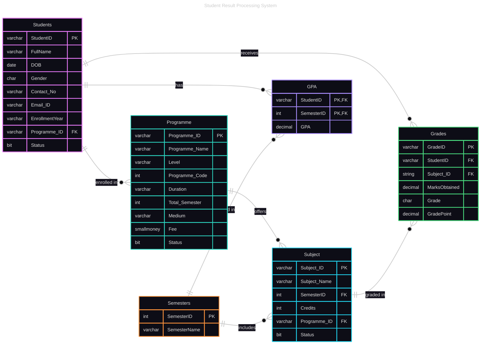

<h1 align="center">Student Result Processing System</h1>

## Abstract
The Student Result Processing System is a comprehensive SQL-based academic management solution designed to automate and streamline the process of calculating, storing, and reporting student grades and GPAs. The system implements advanced database concepts including stored procedures, triggers, window functions, and complex queries to provide real-time GPA calculations, automated ranking systems, and comprehensive result reporting. Built using Microsoft SQL Server 2022, the system demonstrates robust data validation, efficient grade processing, and flexible reporting capabilities suitable for educational institutions of various scales.

## Introduction
Educational institutions face significant challenges in managing student academic records, calculating GPAs, and generating comprehensive reports. Traditional manual processes are error-prone, time-consuming, and lack the flexibility required for modern academic management. This project addresses these challenges by developing a comprehensive Student Result Processing System that automates grade calculations, GPA computations, and result reporting.
         The system is designed with scalability and flexibility in mind, supporting multiple academic programs, semesters, and subjects while maintaining data integrity through comprehensive validation rules and automated triggers. The implementation showcases advanced SQL Server features including stored procedures for business logic encapsulation, triggers for automatic GPA updates, window functions for ranking calculations, and complex queries for comprehensive reporting.

Key objectives achieved include:
         
         - Automated GPA calculation based on credit-weighted grade points
         - Real-time grade processing with automatic GPA updates
         - Flexible ranking system supporting multiple scenarios
         - Comprehensive result reporting and data export capabilities
         - Robust data validation and integrity constraints

## Tools Used

### Primary Technology Stack
- **Microsoft SQL Server 2022**: Primary database management system
- **SQL Server Management Studio (SSMS)**: Database development and management interface
- **Transact-SQL (T-SQL)**: Database programming language for stored procedures and triggers

### Advanced SQL Features Implemented
- **Stored Procedures**: 8 comprehensive procedures for business logic
- **Triggers**: Automatic GPA calculation and updates
- **Window Functions**: Advanced ranking and analytical queries
- **Sequences**: Auto-generated identifiers
- **Cursors**: Complex data processing and reporting
- **MERGE Statements**: Efficient data synchronization
- **Composite Indexes**: Performance optimization and data integrity

### Phase 1: Database Schema Design
1. **Entity Analysis**: Identified 6 core entities 

         Students - Core student information
         Programme - Academic programs/courses
         Semesters - Academic semesters
         Subject - Course subjects
         Grades - Individual subject grades
         GPA - Semester-wise GPA calculations

2. **Schema Creation**: Implemented normalized database design with proper relationships
3. **Constraint Implementation**: Added comprehensive validation rules including:
   - Age validation (students >15 years)
   - Gender validation (M/F/T)
   - Contact number format validation
   - Unique constraints to prevent duplicate grade entries

### Phase 2: Core Data Management
1. **Student Management**: Created following Stored Procedures

   <b><i>SP_GetEnrollmentNo</i></b>

		Used to generate unique 10 digit numberic student id. It requires Admission Date, Programme/Course Name.

		Ex:- Execute SP_GetEnrollmentNo '2025/09/01','BCA'
   
   <b><i>SP_InsertStudent</i></b>

   		Used to insert record with validation student. It requires Course Name, Student Name, Date of Birth,Gender, Contact Number,Email ID,
   		Enrollment Year and it will return confirmation message along with 10 digit student id.
   
		Ex:- Execute SP_InsertStudent 'BAG','Sita','1995/03/26','F','9628697512','Sit@gmail.com','2025'

   <b><i>SP_GetCourseSubject</i></b>

   		Student can view the subjectes based on registered course or without registered also. It can requires Student ID, Course Name, Semester Number
   		based on following senario :-
   
   1) Can show all Subjects of a Course of a student registered for [By Passing Only Student ID]

			Ex:- Execute SP_GetCourseSubject '2504000001'
   
   2) Particular Subjects of a Course based on Semester Number for particular Student ID [By Passing Student ID And Semester No.]

      		Ex:- Execute SP_GetCourseSubject '2504000001',Null,1
   
   3) Can Show All Subjects of a Course [By Passing Only Course Name]

      		Ex:- Execute SP_GetCourseSubject Null,'BCA'
   
   4) Can Show All Subjects of a course based on particular semester no. [By Passing Course Name And Semester Number]

      		EX:- Execute SP_GetCourseSubject Null,'BAG',1
   
   5) Can Show All Subjects of All Courses Available
   
   			Ex: - Execute SP_GetCourseSubject

   <b><i>SP_GetSemeterResult</i></b>

   			Used for checking the statistic of Student Who is enrolled for a course given exam. This will take student id as input and
   			tells you in which subject semester wise you are Pass or Fail based on there Grades points. It required only student ID.
   
   			Ex:- Execute SP_GetSemesterResult '2504000001'
   
3. **Grade Processing**: Created following procedure

	<b><i>SP_InsertGrade</i></b>

   		Used for insert/enter comprehensive grade records in Grades Table with Grade point calculation based on marks,
   		Letter grade assignment, and Duplicate prevention for passed subjects. It required Student ID, Subject Id and
   		Marks that student obtained in subject crossponding to course/program.
   
		Ex:- Execute SP_InsertGrade '2504000001','BCS-011',95
   		
5. **Programme Management**: Established academic program structure with semester mapping

### Phase 3: GPA Calculation System
1. **GPA Logic Implementation**: Developed credit-weighted GPA calculation formula 
2. **Trigger Development**: Created <b><i>Trg_UpdateGPA</i></b> trigger for automatic GPA updates
3. **GPA Reporting**: Create following stored procedure for semester-wise GPA display

   <b><i>SP_GPA</i></b>

   		used to View the GPA of a crossponding Student ID all semester wises. It requires Student ID
   
   		Ex:- Execute SP_GPA '2504000001'
   
5. **Real-time Updates**: Ensured automatic GPA recalculation on grade changes

### Phase 4: Advanced Reporting and Ranking
1. **Ranking System**: Created following stored procedure with 5 different ranking scenarios:
   - Course-wise semester rankings
   - Overall semester rankings
   - Cumulative GPA rankings
   - Cross-course comparisons

	<b><i>SP_GetRank</i></b>

  		Used to find the rank based on GPA and Gross GPA. It requires Course ID, Semester Number, and IsRankGrossGPA='y'
        to rank based on gross all semester rank between all course

   i) Rank based on Course in all semester wise [By Passing Only Course Name as parameter]

  		Ex:- Execute SP_GetRank 'BCA'

  ii) Rank based on specific Course and semeter wise [By Passing Only Course Name and Semester as parameter]

   		Ex:- Execute SP_GetRank 'BCA',1
   
 iii) Rank based on specific semeter for all courses of all students [By Passing Only Semester as parameter]

  		Ex:- Execute SP_GetRank Null,1

  iv) Rank Specific Course Students based on Average GPA in there particular course/programme [By Passing Course Name & in @IsRankGrossGPA value 'y'  as parameter]

   		Ex:- Execute SP_GetRank 'BCA',Null,'y'

   v) Rank All Course Students based on Average GPA in there particular course/programme [By Passing @IsRankGrossGPA value 'y'  as parameter]

		Ex:- Execute SP_GetRank Null,Null,'y'
  
3. **Result Summaries**: Created SP_GetSemResultSummary for comprehensive reporting.

	<b><i>SP_GetSemResultSummary</i><b>

		used to get the result summary of all students of all course at a time. It will display Name of  Student, Student ID, Course Name,
		Semester wise [Subject Name, Marks obtained, Grades, Grades Point, Result :Pass/Fail,GPA] for all student. It does not required any
		parameter.

  		Ex:- Execute SP_GetSemResultSummary

### Phase 5: Data Validation and Testing
1. **Test Data Population**: Inserted comprehensive test data across all entities
2. **Stored Procedure Testing**: Validated all procedures with various parameter combinations
3. **Trigger Testing**: Verified automatic GPA updates and data integrity
4. **Performance Optimization**: Implemented appropriate indexes and query optimization

### Phase 6: Documentation and Deployment
1. **Execution Documentation**: Captured screenshots of all procedure outputs
2. **Data Validation**: Documented table contents and relationships

---
## ER Diagram

## Conclusion

The Student Result Processing System successfully demonstrates the implementation of a comprehensive academic management solution using advanced SQL Server features. The project achieves all stated objectives including automated GPA calculation, flexible ranking systems, comprehensive reporting, and robust data validation.

### Key Achievements
- **Automation**: Eliminated manual GPA calculations through intelligent triggers
- **Flexibility**: Supported multiple ranking scenarios and reporting formats
- **Reliability**: Implemented comprehensive data validation and integrity constraints
- **Scalability**: Designed modular architecture supporting multiple programs and semesters
- **Performance**: Optimized queries and indexes for efficient data processing

### Technical Excellence
The project showcases mastery of advanced SQL concepts including stored procedures, triggers, window functions, and complex query optimization. The implementation demonstrates best practices in database design, data integrity, and system architecture.

### Business Value
The system provides significant value to educational institutions by:
- Reducing administrative workload through automation
- Improving accuracy in grade calculations and reporting
- Enabling flexible and comprehensive academic analysis
- Supporting data-driven decision making through detailed reporting

This project serves as a robust foundation for academic management systems and demonstrates the power of modern SQL Server features in building enterprise-grade educational software solutions.
